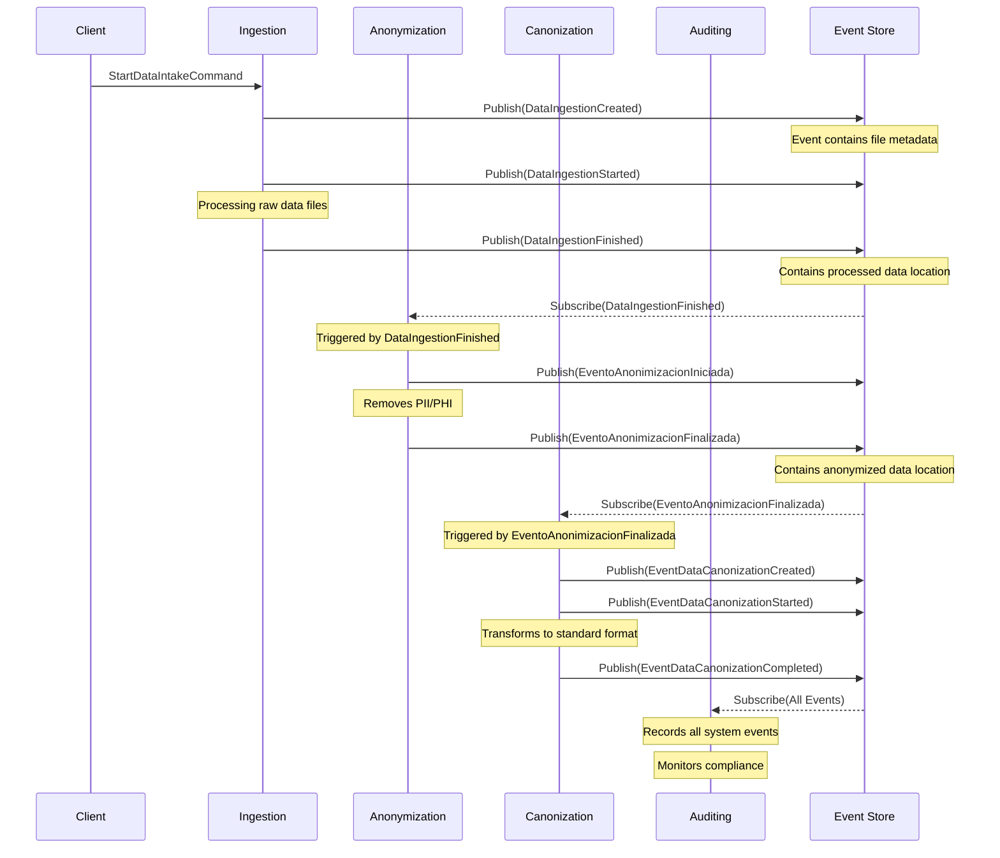

# Microservice Choreography Pattern for Healthcare Data Processing

## Domain Event Choreography SAGA Pattern

In a choreography-based SAGA pattern, each microservice publishes domain events that trigger operations in other microservices, creating a decentralized workflow without a central orchestrator. Domain events in this context are considered "fat" as they contain all necessary information for the receiving service to perform its task without additional queries.

## Key Concepts

- **Domain Events**: Immutable facts that have occurred in the domain. They are "fat" but not delta events (meaning they contain complete information, not just changes).
- **Event Sourcing**: Pattern where state changes are captured as a sequence of immutable events.
- **SAGA Pattern**: Mechanism to maintain data consistency across microservices without distributed transactions.

## System Architecture and Flow

The healthcare data processing system follows these sequential stages: Ingestion → Anonymization → Canonization → Auditing

## Detailed Process Flow

### 1. Ingestion Component
- **Command**: `StartDataIntakeCommand`
- **Events**:
  - `DataIngestionCreated`: Initial event indicating data files have been received
  - `DataIngestionStarted`: Processing of raw data files has begun
  - `DataIngestionFinished`: Raw data processing complete with file locations

### 2. Anonymization Component
- **Triggered by**: `DataIngestionFinished` event
- **Command**: `AnonimizarInformacionMedica`
- **Events**:
  - `EventoAnonimizacionIniciada`: Anonymization process has started
  - `EventoAnonimizacionFinalizada`: Anonymization complete with location of anonymized data

### 3. Canonization Component
- **Triggered by**: `EventoAnonimizacionFinalizada` event
- **Command**: `StartDataCanonizationCommand`
- **Events**:
  - `EventDataCanonizationCreated`: Canonization task created
  - `EventDataCanonizationStarted`: Format standardization begun
  - `EventDataCanonizationCompleted`: Data transformed to canonical format

### 4. Auditing Component
- **Listens to**: All events from all components
- **Commands**: Can access all commands for audit purposes
- **Purpose**: Monitors the entire process for compliance and creates audit trails

## Key Implementation Benefits

1. **Loose Coupling**: Services only need to know about events, not other services directly
2. **Independent Scaling**: Each component can be scaled based on its specific workload
3. **Batch Processing**: Files can be processed independently in parallel
4. **Resilience**: Each service can continue functioning even if others are temporarily unavailable

## References

1. Vernon, V. (2016). *Domain-Driven Design Distilled*. Addison-Wesley Professional.
2. Richardson, C. (2018). *Microservices Patterns*. Manning Publications.
3. Newman, S. (2021). *Building Microservices*, 2nd Edition. O'Reilly Media.
4. Hohpe, G., & Woolf, B. (2003). *Enterprise Integration Patterns*. Addison-Wesley.
5. Kleppmann, M. (2017). *Designing Data-Intensive Applications*. O'Reilly Media.

## Technical Implementation Considerations

- Event messages should be immutable and contain all necessary context
- Consider using a reliable message broker (Kafka, RabbitMQ, etc.)
- Implement idempotent event handlers to prevent duplicate processing
- Include correlation IDs in events to track workflow instances
- Implement compensating transactions for error handling

This architecture allows for maximum decoupling while maintaining the sequential integrity of the healthcare data processing workflow, a critical requirement for medical data handling.
